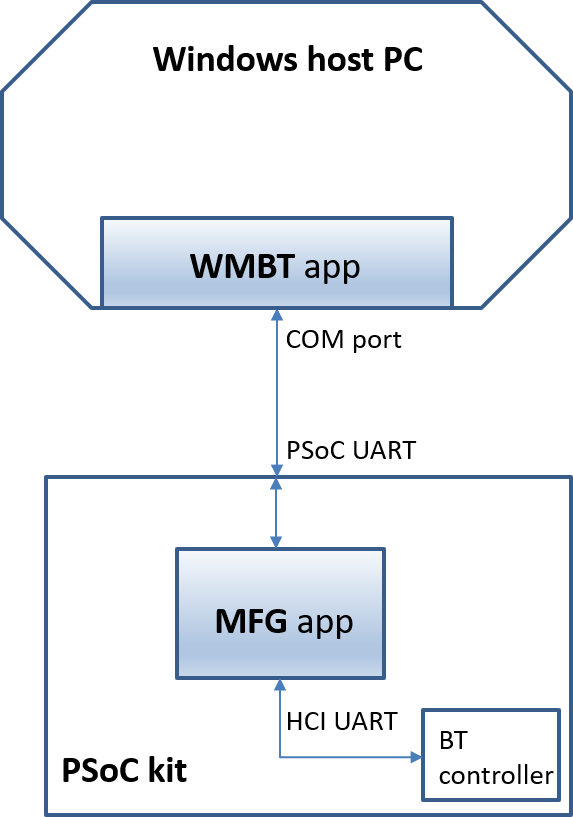

# PSoC 6 MCU: Bluetooth Manufacturing Test Application for FreeRTOS

The Bluetooth Manufacturing Test Application is used to validate the Bluetooth Firmware and RF performance of Cypress SoC Bluetooth BR/EDR/LE devices.

The Bluetooth MFG Application acts as a transport layer between the host "WMBT tool" and Bluetooth Firmware. Mfg Test Application receive commands from the WMBT tool and forwards them to the Bluetooth firmware. The Bluetooth MFG Application also relays the response received back from Bluetooth firmware.

There are 2 parts of the functions for testing.

1. On the PC side, Application (WMBT) running on PC that will send HCI commands and receive HCI events to PSoC board

   1. The SIG defined BLE testing with below 3 standard HCI commands, to test the LE HW functionalities.

      1. LE Transmitter Test Command

      2. LE Receiver Test Command

      3. LE Test End Command

2. On the PSoC side, there will be another application(MFG app) that will do

   1. Bluetooth FW download. This is to download Bluetooth firmware into the controller, so it can have proper controller HW and RF configured.

   2. Route the HCI commands packets received from PC app to another PSoC UART that with BT controller connected.

   2. App received the HCI event from BT controller and route to PSoC UART to host PC application.

## Requirements
- [ModusToolbox™ IDE](https://www.cypress.com/products/modustoolbox-software-environment) v2.2
- Programming Language: C
- Supported Toolchains: Arm® GCC, IAR
- Associated Parts: All [PSoC 6 MCU](http://www.cypress.com/PSoC6) parts

## Dependent assets
- [Bluetooth FreeRtos Library](https://github.com/cypresssemiconductorco/bluetooth-freertos) - Contains bluetooth firmware


## Validated kits
- [PSoC&trade; 6 Wi-Fi Bluetooth&reg; prototyping kit](https://www.cypress.com/CY8CPROTO-062-4343W) (`CY8CPROTO-062-4343W`) - Default target
- [PSoC&trade; 62S2 Wi-Fi Bluetooth&reg; pioneer kit](https://www.cypress.com/CY8CKIT-062S2-43012) (`CY8CKIT-062S2-43012`)
- [PSoC&trade; 6 Wi-Fi Bluetooth&reg; pioneer kit](https://www.cypress.com/CY8CKIT-062-WIFI-BT) (`CY8CKIT-062-WIFI-BT`)
- [PSoC&trade; 62S1 Wi-Fi Bluetooth&reg; pioneer kit](https://www.cypress.com/CYW9P62S1-43438EVB-01) (`CYW9P62S1-43438EVB-01`)
- [PSoC&trade; 64 "Secure Boot" Wi-Fi Bluetooth&reg; pioneer kit](https://www.cypress.com/CY8CKIT-064B0S2-4343W) (`CY8CKIT-064B0S2-4343W`)
- [PSoC&trade; 6 Development Kit](https://www.cypress.com/part/cy8ceval-062s2)(`CY8CEVAL-062S2`) + [1YN M.2 Module](https://www.embeddedartists.com/products/1yn-m-2-module) (`CY8CEVAL-062S2-MUR-43439M2`)

## Hardware Setup

This application uses the board's default configuration. See the kit user guide to ensure that the board is configured correctly.

The application running on a PSoC 6 MCU kit and the test setup are shown below:



Note: The PSoC 6 BLE Pioneer Kit (CY8CKIT-062-BLE) and the PSoC 6 WiFi-BT Pioneer Kit (CY8CKIT-062-WIFI-BT) ship with KitProg2 installed. ModusToolbox software requires KitProg3. Before using this application, make sure that the board is upgraded to KitProg3. The tool and instructions are available in the Firmware Loader GitHub repository. If you do not upgrade, you will see an error like "unable to find CMSIS-DAP device" or "KitProg firmware is out of date".


## Software Setup

1. This application requires WMBT Tool running on a windows PC and uses UART port for communication with target. The pre-built executables for WMBT Tool are available in btsdk-utils/wmbt/bin/ directory, which sync from [btsdk-utils](https://github.com/cypresssemiconductorco/btsdk-utils). and user guide is in [Bluetooth Manufacturing Test Tool](https://www.cypress.com/file/298091/download).

2. IQxel tool as transmitter to send fixed count test packet which to ensure whatever is sent from the transmitter would received by the receiver, without any error.

3. Using Sniffer to ensure whatever is test packet is in same transmit channel, packet length and data patterns from transmitter.

4. Better to test it in the shield room to avoid air interference.

## Using the Application

Create the project and open it using one of the following:

<details><summary><b>In Eclipse IDE for ModusToolbox&trade; software</b></summary>

1. Click the **New Application** link in the **Quick Panel** (or, use **File** > **New** > **ModusToolbox Application**). This launches the [Project Creator](http://www.cypress.com/ModusToolboxProjectCreator) tool.

2. Pick a kit supported by the code example from the list shown in the **Project Creator - Choose Board Support Package (BSP)** dialog.

   When you select a supported kit, the example is reconfigured automatically to work with the kit. To work with a different supported kit later, use the [Library Manager](https://www.cypress.com/ModusToolboxLibraryManager) to choose the BSP for the supported kit. You can use the Library Manager to select or update the BSP and firmware libraries used in this application. To access the Library Manager, click the link from the **Quick Panel**.

   You can also just start the application creation process again and select a different kit.

   If you want to use the application for a kit not listed here, you may need to update the source files. If the kit does not have the required resources, the application may not work.

3. In the **Project Creator - Select Application** dialog, choose the example by enabling the checkbox.

4. Optionally, change the suggested **New Application Name**.

5. The **Application(s) Root Path** defaults to the Eclipse workspace which is usually the desired location for the application. If you want to store the application in a different location, you can change the *Application(s) Root Path* value. Applications that share libraries should be in the same root path.

6. Click **Create** to complete the application creation process.

For more details, see the [Eclipse IDE for ModusToolbox&trade; software user guide](https://www.cypress.com/MTBEclipseIDEUserGuide) (locally available at *{ModusToolbox&trade; software install directory}/ide_{version}/docs/mt_ide_user_guide.pdf*).

</details>

<details><summary><b>In command-line interface (CLI)</b></summary>

ModusToolbox&trade; software provides the Project Creator as both a GUI tool and a command line tool, "project-creator-cli". The CLI tool can be used to create applications from a CLI terminal or from within batch files or shell scripts. This tool is available in the *{ModusToolbox&trade; install directory}/tools_{version}/project-creator/* directory.

Use a CLI terminal to invoke the "project-creator-cli" tool. On Windows, use the command line "modus-shell" program provided in the ModusToolbox&trade; installation instead of a standard Windows command-line application. This shell provides access to all ModusToolbox&trade; tools. You can access it by typing `modus-shell` in the search box in the Windows menu. In Linux and macOS, you can use any terminal application.

The following table lists the arguments for this tool:

Argument | Description | Required/optional
---------|-------------|-----------
`--board-id` | Defined in the `<id>` field of the [BSP](https://github.com/Infineon?q=bsp-manifest&type=&language=&sort=) manifest | Required
`--app-id`   | Defined in the `<id>` field of the [CE](https://github.com/Infineon?q=ce-manifest&type=&language=&sort=) manifest | Required
`--target-dir`| Specify the directory in which the application is to be created if you prefer not to use the default current working directory | Optional
`--user-app-name`| Specify the name of the application if you prefer to have a name other than the example's default name | Optional


The following example will clone the "[Bluetooth Mfg Tester](https://github.com/Infineon/mtb-anycloud-bluetooth-mfg-tester)" application with the desired name "MyBluetoothMfgTester" configured for the *CY8CKIT-062-WIFI-BT* BSP into the specified working directory, *C:/mtb_projects*:

   ```
   project-creator-cli --board-id CY8CKIT-062-WIFI-BT --app-id mtb-anycloud-bluetooth-mfg-tester --user-app-name MyBluetoothMfgTester --target-dir "C:/mtb_projects"
   ```

**Note:** The project-creator-cli tool uses the `git clone` and `make getlibs` commands to fetch the repository and import the required libraries. For more details, see the "Project creator tools" section of the [ModusToolbox&trade; software user guide](https://www.cypress.com/ModusToolboxUserGuide) (locally available at *{ModusToolbox&trade; install directory}/docs_{version}/mtb_user_guide.pdf*).

</details>

<details><summary><b>In third-party IDEs</b></summary>

Use one of the following options:

- **Use the standalone [Project Creator](http://www.cypress.com/ModusToolboxProjectCreator) tool:**

   1. Launch Project Creator from the Windows Start menu or from *{ModusToolbox&trade; install directory}/tools_{version}/project-creator/project-creator.exe*.

   2. In the initial **Choose Board Support Package** screen, select the BSP and click **Next**.

   3. In the **Select Application** screen, select the appropriate IDE from the **Target IDE** drop-down menu.

   4. Click **Create** and follow the instructions printed in the bottom pane to import or open the exported project in the respective IDE.

- **Use command-line interface (CLI):**

1. Follow the instructions from the **In command-line interface (CLI)** section to create the application, and import the libraries using the `make getlibs` command.

2. Export the application to a supported IDE using the `make <ide>` command.

3. Follow the instructions displayed in the terminal to create or import the application as an IDE project.

For a list of supported IDEs and more details, see the "Exporting to IDEs" section of the [ModusToolbox&trade; software user guide](https://www.cypress.com/ModusToolboxUserGuide) (locally available at *{ModusToolbox&trade; install directory}/docs_{version}/mtb_user_guide.pdf*).

</details>


## Operation

1. Go to WMBT tool directory

2. Reset the Board by pressing SW1 button

3. Run the command on Windows Host for the proper BT Chip on target board.

4. Observe the output of the command

5. List of wmbt commands with BLE function which can be retrieved by typing --help
   Partial output of the command and display is below.

		Usage: wmbt reset COMx
		Usage: wmbt le_receiver_test COMx <rx_frequency>
		Usage: wmbt le_transmitter_test COMx <tx_frequency> <data_length> <data_pattern>
		Usage: wmbt le_test_end COMx
